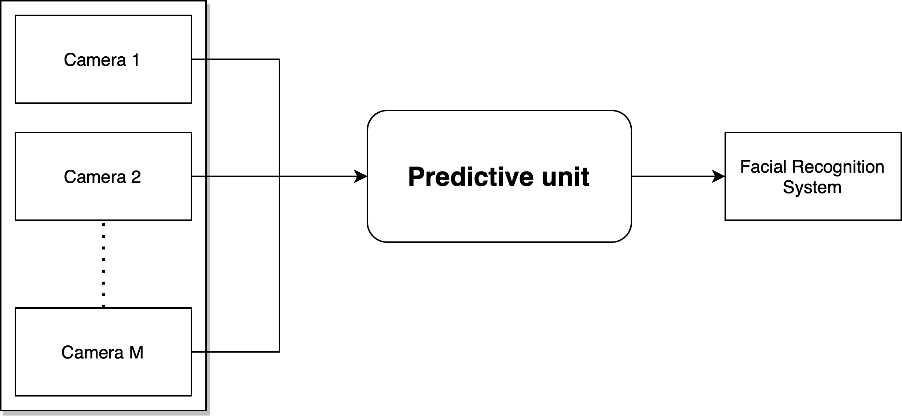
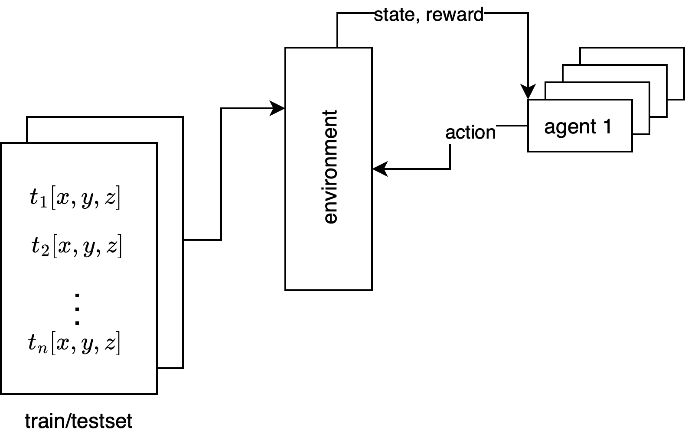

[](https://www.uva.nl/en)
&nbsp;&nbsp;&nbsp;&nbsp;&nbsp;&nbsp;&nbsp;&nbsp;
[](https://mns-research.nl)

# ROFARS-MNS
**Resource Optimization for Facial Recognition Systems**

Facial recognition systems have found substantial applications in various industries, including security, marketing, and healthcare. Nevertheless, their real-time applications pose significant computational challenges. This thesis explores the strengths and limitations of different machine learning algorithms: UCB-1, SW-UCB, D-UCB, and LSTM in optimising resource allocation and traffic flow prediction for facial recognition systems. Through an empirical analysis, it was found that UCB-1, while computationally efficient and suitable for quick decision-making, falls short in non-stationary environments due to its assumption of stationary reward distributions and its inability to adapt to changing reward distributions. In contrast, the SW-UCB and D-UCB algorithms, although more computationally intensive, exhibited superior performance in dynamic environments due to their recency bias. 

Nevertheless, their performance is strongly influenced by the tuning of their key hyperparameters. LSTM networks performed well in stationary or slowly changing environments, yet their performance was limited in non-stationary conditions due to inherent assumptions of stationarity and challenges in tracking rapid changes. The results also showed that the choice of data handling methods, specifically the imputation method within the LSTM framework, can significantly impact performance. In conclusion, the choice of an algorithm for real-world applications should consider the specific requirements and constraints of the situation. Future research directions include enhancing the performance of UCB-1 in non-stationary environments, improving hyperparameter tuning for SW-UCB and D-UCB, adapting LSTM for non-stationary conditions, and exploring alternative data handling techniques for dealing with missing or inconsistent data. This study serves as a stepping stone towards a more nuanced understanding of different machine learning algorithms, underlining the importance of adaptability, computational efficiency, and performance trade-offs.

## System Diagram


Ths diagram illustrates the progression of data from multiple cameras via the predictive unit, culminating in the facial recognition system.

## Python-based Environment



* rofarsEnv.py - simulation environment
* agents.py - implementations for agents (LSTM and UCB agents by Jasper Bruin)
* example.py - example of how everything is put together
* UCBtest.py - testing and training script for the use of different UCB agents.
* RNNtest.py - testing and training script that uses historical traffic data from existing agents in agents.py

## Dataset
* data/train_test.txt (878,858 lines)

## Dependencies
* the code supports Python 3.7+
```
pip install numpy==1.24.2 pandas==1.5.3 tqdm==4.64.1
```
## Usage
* add your algorithm implementations to `agents.py`
* adapt `example.py` for use in experiments
```
python example.py
```
## Possible Solutions
* [Multi-armed bandit problem](https://en.wikipedia.org/wiki/Multi-armed_bandit)
  - [Epsilon-greedy strategy](https://gdmarmerola.github.io/ts-for-bernoulli-bandit)
  - [Thompson sampling](https://gdmarmerola.github.io/ts-for-bernoulli-bandit)
  - [Upper Confidence Bound (UCB)](https://gdmarmerola.github.io/ts-for-bernoulli-bandit)
  - [Non-stationary bandit](https://gdmarmerola.github.io/non-stationary-bandits)
  
* [Traffic flow prediction](https://www.sciencedirect.com/science/article/pii/S2210537922000725)</br>


* [(Deep) reinforcement learning](https://en.wikipedia.org/wiki/Deep_reinforcement_learning)
  - https://spinningup.openai.com/en/latest/
  - https://stable-baselines.readthedocs.io/en/master/
  - https://huggingface.co/deep-rl-course/unit1/rl-framework

## Contributors
* Jasper Bruin - Author of the LSTM and UCB agents 

## Contact
Cyril Hsu - s.h.hsu@uva.nl

Dr. Chrysa Papagianni - c.papagianni@uva.nl

Jasper Bruin - jasperbruin@me.com

## License 

[](https://www.gnu.org/licenses/gpl-3.0)

GNU GENERAL PUBLIC LICENSE  
Version 3, 29 June 2007

This program is free software: you can redistribute it and/or modify
it under the terms of the GNU General Public License as published by
the Free Software Foundation, either version 3 of the License, or
(at your option) any later version.

This program is distributed in the hope that it will be useful,
but WITHOUT ANY WARRANTY; without even the implied warranty of
MERCHANTABILITY or FITNESS FOR A PARTICULAR PURPOSE.  See the
GNU General Public License for more details.

You should have received a copy of the GNU General Public License
along with this program.  If not, see <https://www.gnu.org/licenses/>.
